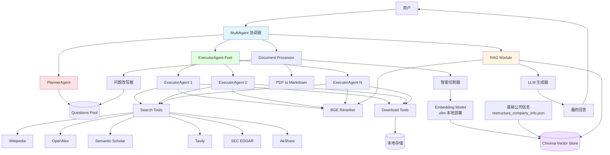
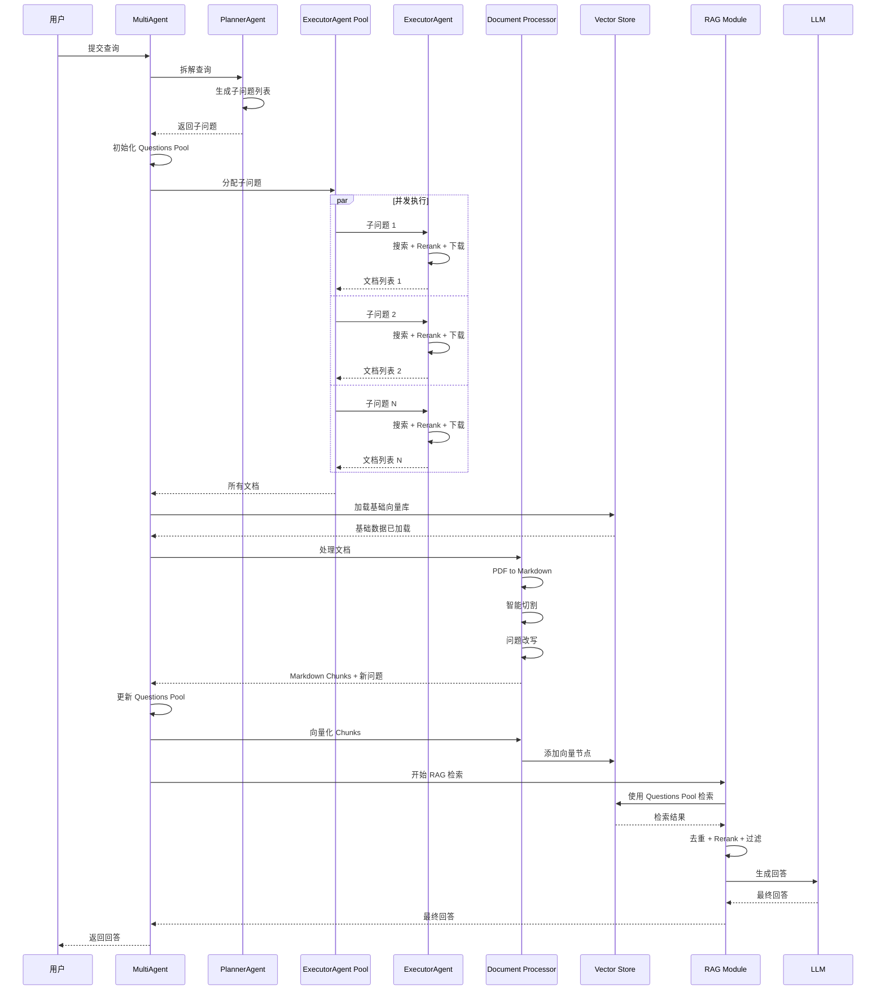

# 设计文档

## 概述

Multi-Agent 深度搜索系统是一个基于多智能体协作的文献检索和问答系统。系统通过 PlannerAgent 将用户的复杂查询拆解为多个子问题，使用 ExecutorAgent Pool 并发执行搜索和文档处理，最终通过 RAG（检索增强生成）技术生成高质量的回答。

### 核心特性

- **智能查询拆解**: 使用 LLM 将复杂查询拆解为多个具体子问题
- **并发执行**: ExecutorAgent Pool 支持多个子问题并发处理
- **多源搜索**: 集成 Wikipedia、OpenAlex、Semantic Scholar、Tavily 等多个数据源
- **智能重排序**: 使用本地部署的 BGE Reranker 提高检索质量
- **文档处理**: PDF 转 Markdown，智能切割和向量化
- **问题扩充**: 从文档中提取关键信息并改写为问题
- **混合检索**: 结合基础公司信息和文档语料进行检索
- **本地部署**: 使用 vllm 部署的本地 Embedding 模型

## 架构设计

### 系统架构图



### 数据流设计



## 组件和接口

### 1. MultiAgent 协调器

**职责**: 整体流程编排，协调各个组件

**接口**:

```python
class MultiAgent:
    def __init__(
        self,
        pool: AsyncConnectionPool,
        executor_pool_size: int = Config.EXECUTOR_POOL_SIZE,
        planner_model: str = Config.LLM_PLANNER,
        executor_model: str = Config.LLM_EXECUTOR
    ):
        """初始化 MultiAgent
        
        Args:
            pool: PostgreSQL 连接池（用于短期记忆）
            executor_pool_size: ExecutorAgent 池大小
            planner_model: PlannerAgent 使用的模型
            executor_model: ExecutorAgent 使用的模型
        """
        pass
    
    async def process_query(self, user_query: str, thread_id: str) -> Dict[str, Any]:
        """处理用户查询的完整流程
        
        Args:
            user_query: 用户输入的查询
            thread_id: 会话线程 ID
            
        Returns:
            包含最终回答和元数据的字典
        """
        pass
    
    async def _initialize_vector_store(self) -> VectorStoreIndex:
        """初始化向量存储，加载基础公司信息数据"""
        pass
    
    async def _cleanup(self):
        """清理资源"""
        pass
```

**状态管理**:

```python
class MultiAgentState(TypedDict):
    user_query: str
    questions_pool: List[str]  # 包含原始子问题和改写问题
    all_documents: List[Dict]  # 所有下载的文档
    markdown_chunks: List[Dict]  # 切割后的 Markdown 片段
    vector_store: VectorStoreIndex  # 向量存储索引
    retrieved_context: List[Dict]  # 检索到的语料
    final_answer: str  # 最终回答
```

### 2. PlannerAgent（已实现）

**职责**: 将用户查询拆解为多个子问题

**现有实现**: `agents/agents.py` 中的 `PlannerAgent` 类

**关键方法**:
- `_json_node()`: 使用 LLM 生成子问题列表（JSON 格式）
- `_condition_router()`: 验证 JSON 格式并决定是否继续迭代

### 3. ExecutorAgent（已实现）

**职责**: 执行单个子问题的搜索、重排序和下载流程

**现有实现**: `agents/agents.py` 中的 `ExecutorAgent` 类

**关键方法**:
- `_llm_decision_node()`: LLM 决策是否调用可选工具
- `_optional_tool_node()`: 执行可选工具（SEC EDGAR, AkShare）
- `_search_node()`: 并发调用必需搜索工具
- `_clean_node()`: 使用 Reranker 重排序
- `_download_node()`: 下载文档到本地

### 4. ExecutorAgent Pool

**职责**: 管理多个 ExecutorAgent 实例，支持并发执行

**接口**:

```python
class ExecutorAgentPool:
    def __init__(
        self,
        pool: AsyncConnectionPool,
        pool_size: int,
        model: str = Config.LLM_EXECUTOR
    ):
        """初始化 ExecutorAgent Pool
        
        Args:
            pool: PostgreSQL 连接池
            pool_size: 池大小
            model: 使用的模型
        """
        self.agents: List[ExecutorAgent] = []
        self.pool_size = pool_size
        self._initialize_agents(pool, model)
    
    def _initialize_agents(self, pool: AsyncConnectionPool, model: str):
        """创建指定数量的 ExecutorAgent 实例"""
        for i in range(self.pool_size):
            agent = ExecutorAgent(pool, model)
            self.agents.append(agent)
    
    async def execute_questions(
        self,
        questions: List[str],
        base_thread_id: str
    ) -> List[Dict]:
        """并发执行多个子问题
        
        Args:
            questions: 子问题列表
            base_thread_id: 基础线程 ID
            
        Returns:
            所有 ExecutorAgent 的结果列表
        """
        tasks = []
        for i, question in enumerate(questions):
            agent = self.agents[i % self.pool_size]
            thread_id = f"{base_thread_id}_executor_{i}"
            tasks.append(agent.invoke(question, thread_id))
        
        results = await asyncio.gather(*tasks, return_exceptions=True)
        
        # 处理异常
        valid_results = []
        for i, result in enumerate(results):
            if isinstance(result, Exception):
                logger.error(f"子问题 {i} 执行失败: {result}")
            else:
                valid_results.append(result)
        
        return valid_results
    
    async def cleanup(self):
        """清理所有 Agent 资源"""
        for agent in self.agents:
            await agent._clean()
```

### 5. Document Processor

**职责**: PDF 转 Markdown、智能切割、问题改写

**接口**:

```python
class DocumentProcessor:
    def __init__(
        self,
        embedding_model: BaseEmbedding,
        llm: BaseLLM,
        mineru_base_url: str = Config.MINERU_BASE_URL
    ):
        """初始化文档处理器
        
        Args:
            embedding_model: 本地 vllm 部署的 Embedding 模型
            llm: 用于问题改写的 LLM
            mineru_base_url: vllm 部署的 MinerU 服务地址
        """
        self.embedding_model = embedding_model
        self.llm = llm
        self.mineru_base_url = mineru_base_url
    
    async def process_documents(
        self,
        documents: List[Dict],
        doc_path: str = Config.DOC_SAVE_PATH
    ) -> Tuple[List[Document], List[str]]:
        """处理文档：转换、切割、问题改写
        
        Args:
            documents: 文档元数据列表
            doc_path: 文档存储路径
            
        Returns:
            (LlamaIndex Document 列表, 改写的问题列表)
        """
        pass
    
    async def _pdf_to_markdown(self, pdf_path: str) -> str:
        """将 PDF 转换为 Markdown
        
        使用 vllm 部署的 MinerU 进行转换
        """
        pass
    
    def _split_by_headers(self, markdown_text: str) -> List[str]:
        """按标题等级切割 Markdown"""
        pass
    
    def _split_by_sentences(self, text: str, max_length: int) -> List[str]:
        """按语句边界切割超长文本"""
        pass
    
    async def _rewrite_to_questions(self, chunks: List[str]) -> List[str]:
        """从文档片段中提取关键信息并改写为问题"""
        pass
```

**Markdown 切割策略**:

1. **按标题等级切割**:
   - 识别 H1 (`#`), H2 (`##`), H3 (`###`) 标题
   - 每个标题及其内容作为一个独立的 chunk
   - 保留标题层级信息作为元数据

2. **超长文本处理**:
   - 如果 chunk 超过 `max_chunk_size`（默认 1000 字符）
   - 按句子边界（`.`, `!`, `?`, `。`, `！`, `？`）进一步切割
   - 确保每个 chunk 不超过最大长度

3. **元数据保留**:
   - 文档来源（source）
   - 标题层级（header_level）
   - 原始文档标题（doc_title）
   - 切割位置（chunk_index）

**问题改写策略**:

使用 LLM 分析每个 Markdown chunk，提取关键信息并改写为问题形式：

```python
QUESTION_REWRITE_PROMPT = """
分析以下文档片段，提取其中的关键信息，并将其改写为 1-3 个具体的问题。

文档片段：
{chunk}

要求：
1. 问题应该具体且明确
2. 问题应该能够通过文档内容回答
3. 避免过于宽泛或模糊的问题
4. 每个问题独立成行

改写的问题：
"""
```

### 6. RAG Module

**职责**: 向量检索、去重、重排序、答案生成

**接口**:

```python
class RAGModule:
    def __init__(
        self,
        vector_store: VectorStoreIndex,
        reranker: BGEReranker,
        llm: BaseLLM,
        top_k: int = Config.TOP_K,
        rerank_top_n: int = Config.RERANK_TOP_N
    ):
        """初始化 RAG 模块
        
        Args:
            vector_store: 向量存储索引
            reranker: BGE Reranker 实例
            llm: 用于生成回答的 LLM
            top_k: 每个问题检索的文档数
            rerank_top_n: Rerank 后保留的文档数
        """
        self.vector_store = vector_store
        self.reranker = reranker
        self.llm = llm
        self.top_k = top_k
        self.rerank_top_n = rerank_top_n
    
    async def retrieve_and_generate(
        self,
        questions_pool: List[str],
        original_query: str
    ) -> Dict[str, Any]:
        """检索相关语料并生成回答
        
        Args:
            questions_pool: 所有问题（原始 + 改写）
            original_query: 用户的原始查询
            
        Returns:
            包含回答和检索元数据的字典
        """
        pass
    
    async def _retrieve_contexts(
        self,
        questions: List[str]
    ) -> List[NodeWithScore]:
        """从向量库检索相关语料"""
        pass
    
    def _deduplicate_contexts(
        self,
        contexts: List[NodeWithScore]
    ) -> List[NodeWithScore]:
        """去重检索结果"""
        pass
    
    async def _rerank_contexts(
        self,
        query: str,
        contexts: List[NodeWithScore]
    ) -> List[NodeWithScore]:
        """使用 Reranker 重排序"""
        pass
    
    async def _generate_answer(
        self,
        query: str,
        contexts: List[NodeWithScore],
        questions_pool: List[str]
    ) -> str:
        """生成最终回答"""
        pass
```

**检索策略**:

1. **多问题检索**:
   - 对 Questions Pool 中的每个问题独立检索
   - 每个问题检索 top_k 个最相关节点
   - 合并所有检索结果

2. **去重策略**:
   - 基于节点内容的哈希值去重
   - 保留相似度最高的节点

3. **重排序**:
   - 使用原始用户查询作为 query
   - 对所有去重后的节点进行 Rerank
   - 保留 top_n 个最相关节点

4. **答案生成提示词**:

```python
ANSWER_GENERATION_PROMPT = """
你是一个专业的研究助手。基于以下信息回答用户的问题。

用户问题：
{original_query}

相关子问题：
{questions_pool}

检索到的相关信息：
{retrieved_contexts}

要求：
1. 回答应该全面且准确
2. 引用具体的来源信息
3. 如果信息不足，明确说明
4. 使用清晰的结构组织回答

回答：
"""
```

### 7. Vector Store 管理

**职责**: 管理 Chroma 向量数据库，支持基础数据加载和增量更新

**接口**:

```python
class VectorStoreManager:
    def __init__(
        self,
        persist_dir: str = Config.VECTOR_STORE_PATH,
        collection_name: str = Config.VECTTOR_BASE_COLLECTION_NAME,
        embedding_model: BaseEmbedding = None
    ):
        """初始化向量存储管理器
        
        Args:
            persist_dir: 向量库持久化路径
            collection_name: 集合名称
            embedding_model: 本地 vllm 部署的 Embedding 模型
        """
        self.persist_dir = persist_dir
        self.collection_name = collection_name
        self.embedding_model = embedding_model or self._get_local_embedding_model()
        self.chroma_client = None
        self.vector_store = None
        self.index = None
    
    def _get_local_embedding_model(self) -> BaseEmbedding:
        """获取本地 vllm 部署的 Embedding 模型"""
        from llama_index.embeddings.openai import OpenAIEmbedding
        
        return OpenAIEmbedding(
            model=Config.EMBEDDING_MODEL_NAME,
            api_base=Config.VLLM_BASE_URL,
            api_key="EMPTY"  # vllm 不需要真实 API key
        )
    
    async def load_base_vector_store(
        self,
        base_data_path: str = Config.BASEDATA_RESTRUCTURE_PATH
    ) -> VectorStoreIndex:
        """加载基础向量库（公司信息）
        
        Args:
            base_data_path: 基础数据 JSON 文件路径
            
        Returns:
            VectorStoreIndex 实例
        """
        pass
    
    async def add_documents(
        self,
        documents: List[Document]
    ) -> VectorStoreIndex:
        """向现有向量库添加新文档
        
        Args:
            documents: LlamaIndex Document 列表
            
        Returns:
            更新后的 VectorStoreIndex
        """
        pass
    
    def get_retriever(self, top_k: int = Config.TOP_K):
        """获取检索器"""
        return self.index.as_retriever(similarity_top_k=top_k)
```

## 数据模型

### Questions Pool

```python
@dataclass
class QuestionsPool:
    """问题池数据模型"""
    original_questions: List[str]  # PlannerAgent 生成的原始子问题
    rewritten_questions: List[str]  # 从文档改写的问题
    
    def get_all_questions(self) -> List[str]:
        """获取所有问题"""
        return self.original_questions + self.rewritten_questions
    
    def add_rewritten_questions(self, questions: List[str]):
        """添加改写的问题"""
        self.rewritten_questions.extend(questions)
```

### Document Metadata

```python
@dataclass
class DocumentMetadata:
    """文档元数据"""
    source: str  # 数据源（openalex, semantic_scholar, etc.）
    title: str  # 文档标题
    abstract: str  # 摘要
    url: str  # 原始 URL
    local_path: str  # 本地存储路径
    rerank_score: float  # Rerank 分数
    download_time: datetime  # 下载时间
```

### Markdown Chunk

```python
@dataclass
class MarkdownChunk:
    """Markdown 切割片段"""
    content: str  # 内容
    doc_title: str  # 原始文档标题
    source: str  # 来源
    header_level: int  # 标题层级（0=无标题, 1=H1, 2=H2, 3=H3）
    chunk_index: int  # 在文档中的位置
    embedding: Optional[List[float]] = None  # 向量（可选）
```

### Retrieved Context

```python
@dataclass
class RetrievedContext:
    """检索到的语料"""
    content: str  # 内容
    source: str  # 来源（base_data 或文档标题）
    score: float  # 相似度分数
    metadata: Dict[str, Any]  # 其他元数据
```

## 正确性属性

在编写正确性属性之前，我需要先分析需求文档中的验收标准，判断哪些可以转化为可测试的属性。


## 正确性属性

属性是系统在所有有效执行中应该保持为真的特征或行为。属性作为人类可读规范和机器可验证正确性保证之间的桥梁。

### 属性 1: 查询拆解最小数量

*对于任意*用户查询，当 PlannerAgent 成功拆解后，返回的子问题数量应该 >= 3

**验证需求: 1.1**

### 属性 2: 子问题存储完整性

*对于任意*PlannerAgent 拆解结果，Questions_Pool 应该包含所有生成的子问题

**验证需求: 1.3**

### 属性 3: JSON 格式输出

*对于任意*PlannerAgent 拆解结果，输出应该是有效的 JSON 格式，且包含 "tasks" 字段

**验证需求: 1.5**

### 属性 4: ExecutorAgent Pool 大小一致性

*对于任意*配置的 pool_size 值，初始化后的 ExecutorAgent_Pool 中的 Agent 数量应该等于 pool_size

**验证需求: 2.1, 9.2**

### 属性 5: 并发执行完整性

*对于任意*子问题列表，ExecutorAgent_Pool 应该为每个子问题分配执行，且最终结果数量 <= 子问题数量（允许部分失败）

**验证需求: 2.2, 2.4**

### 属性 6: 执行独立性和容错性

*对于任意*ExecutorAgent 执行失败的情况，其他 ExecutorAgent 应该继续正常执行并返回结果

**验证需求: 2.3, 2.5, 11.2**

### 属性 7: 必需工具调用完整性

*对于任意*子问题，ExecutorAgent 应该调用所有配置的必需搜索工具（wikipedia_search, openalex_search, semantic_scholar_search, tavily_search）

**验证需求: 3.1**

### 属性 8: 搜索结果合并

*对于任意*多个搜索工具的返回结果，合并后的列表应该包含所有工具返回的文档

**验证需求: 3.2**

### 属性 9: 文档下载路径正确性

*对于任意*下载成功的文档，其本地路径应该在配置的 DOC_SAVE_PATH 目录下

**验证需求: 3.4**

### 属性 10: Rerank 分数过滤

*对于任意*经过 Rerank 过滤的文档列表，所有保留的文档的 rerank_score 应该 >= 配置的阈值

**验证需求: 4.3, 7.6, 9.4**

### 属性 11: Rerank Top-N 限制

*对于任意*Rerank 结果，保留的文档数量应该 <= 配置的 top_n 值

**验证需求: 4.4**

### 属性 12: 本地 Embedding 模型使用

*对于任意*向量化操作，使用的 Embedding 模型的 API base URL 应该指向本地 vllm 服务而非远程 API

**验证需求: 5.2**

### 属性 13: PDF 到 Markdown 转换

*对于任意*PDF 文档，使用 vllm 部署的 MinerU 转换后的输出应该是有效的 Markdown 格式（包含标题、段落等 Markdown 元素）

**验证需求: 5.3**

### 属性 14: Markdown 按标题切割

*对于任意*包含标题的 Markdown 文档，切割点应该在标题位置（H1, H2, H3）

**验证需求: 5.4**

### 属性 15: Chunk 长度限制

*对于任意*切割后的 Markdown_Chunk，其长度应该 <= 配置的 max_chunk_size

**验证需求: 5.5**

### 属性 16: 向量化完整性

*对于任意*Markdown_Chunk 列表，每个 chunk 都应该有对应的向量表示

**验证需求: 5.6**

### 属性 17: 向量库增量更新

*对于任意*新添加的文档节点，向量库的总节点数量应该增加相应的数量

**验证需求: 5.7**

### 属性 18: 问题改写格式

*对于任意*从文档改写的问题，应该是问题形式（例如以问号结尾）

**验证需求: 6.3**

### 属性 19: Questions Pool 更新

*对于任意*改写的问题列表，Questions_Pool 应该包含这些新问题

**验证需求: 6.4**

### 属性 20: Questions Pool 去重

*对于任意*Questions_Pool，其中不应该包含完全相同的问题

**验证需求: 6.5**

### 属性 21: 向量库数据完整性

*对于任意*RAG 检索操作，Vector_Store 应该同时包含基础公司信息数据和 Markdown 文档节点

**验证需求: 7.1**

### 属性 22: 检索查询覆盖

*对于任意*Questions_Pool，RAG_Module 应该使用其中的每个问题进行检索

**验证需求: 7.2**

### 属性 23: 检索结果数量限制

*对于任意*单个问题的检索结果，返回的节点数量应该 <= 配置的 top_k

**验证需求: 7.3**

### 属性 24: 检索结果去重

*对于任意*检索结果列表，去重后不应该包含内容完全相同的节点

**验证需求: 7.4**

### 属性 25: Rerank 结果排序

*对于任意*经过 Rerank 的检索结果，应该按相关性分数降序排列

**验证需求: 7.5**

### 属性 26: 答案生成提示词完整性

*对于任意*答案生成请求，构建的提示词应该包含原始查询、Questions_Pool 和 Retrieved_Context

**验证需求: 8.1**

### 属性 27: 答案非空性

*对于任意*成功的答案生成，Final_Answer 应该是非空字符串

**验证需求: 8.2**

### 属性 28: 答案引用来源

*对于任意*生成的 Final_Answer，应该包含对 Retrieved_Context 来源的引用

**验证需求: 8.3**

### 属性 29: 操作日志记录

*对于任意*关键操作（查询拆解、文档下载、向量化、答案生成），日志文件应该包含相应的时间戳和执行结果记录

**验证需求: 8.4, 11.5**

### 属性 30: 配置加载正确性

*对于任意*系统初始化，所有配置参数应该从 Config 类正确加载

**验证需求: 9.1**

### 属性 31: 批处理大小应用

*对于任意*Reranker 或 Embedding 批处理操作，实际批处理大小应该 <= 配置的 batch_size

**验证需求: 9.3**

### 属性 32: 短期记忆类型正确性

*对于任意*PlannerAgent 或 ExecutorAgent 实例，其 memory 属性应该是 AsyncPostgresSaver 类型

**验证需求: 10.1**

### 属性 33: 状态持久化

*对于任意*Agent 处理任务，其状态和消息应该被保存到 PostgreSQL 数据库

**验证需求: 10.2**

### 属性 34: 状态恢复一致性

*对于任意*保存的 Agent 状态，恢复后的状态应该与保存时的状态一致

**验证需求: 10.3**

### 属性 35: 异常日志记录

*对于任意*系统异常，日志文件应该包含完整的错误堆栈信息

**验证需求: 11.1**

### 属性 36: 错误消息友好性

*对于任意*关键组件失败，返回给用户的错误消息应该是人类可读的友好格式（不包含技术堆栈）

**验证需求: 11.3**

### 属性 37: 日志文件轮转

*对于任意*日志文件大小超过配置限制的情况，应该自动创建备份日志文件

**验证需求: 11.4**

## 错误处理

### 错误类型和处理策略

#### 1. PlannerAgent 拆解失败

**场景**: LLM 无法生成有效的 JSON 格式子问题列表

**处理策略**:
- 重试最多 `PLANNER_EPOCH` 次（默认 3 次）
- 如果仍然失败，返回错误信息给用户
- 记录详细的失败原因到日志

**错误消息示例**:
```
"抱歉，无法将您的查询拆解为子问题。请尝试重新表述您的问题。"
```

#### 2. ExecutorAgent 执行失败

**场景**: 搜索工具调用失败、下载失败、Rerank 失败

**处理策略**:
- 单个 ExecutorAgent 失败不影响其他 Agent
- 记录失败原因但继续执行
- 收集所有成功的结果
- 如果所有 Agent 都失败，返回错误信息

**降级策略**:
- 搜索工具失败：跳过该工具，使用其他工具的结果
- Rerank 失败：使用原始搜索结果
- 下载失败：跳过该文档，继续处理其他文档

#### 3. 文档处理失败

**场景**: PDF 转换失败、切割失败、向量化失败

**处理策略**:
- 单个文档失败不影响其他文档
- 记录失败的文档信息
- 继续处理其他文档
- 如果所有文档都失败，使用基础向量库进行检索

#### 4. RAG 检索失败

**场景**: 向量库查询失败、Rerank 失败

**处理策略**:
- 如果向量库查询失败，尝试重新连接
- 如果 Rerank 失败，使用原始检索结果
- 如果完全无法检索，返回错误信息

#### 5. 答案生成失败

**场景**: LLM 调用失败、超时

**处理策略**:
- 重试最多 3 次
- 如果仍然失败，返回部分检索结果给用户
- 提供友好的错误消息

**降级响应示例**:
```
"抱歉，无法生成完整的回答。以下是检索到的相关信息：
[检索结果摘要]
"
```

#### 6. 短期记忆连接失败

**场景**: PostgreSQL 连接失败

**处理策略**:
- 记录错误并尝试重新连接
- 如果重连失败，使用内存存储作为降级方案
- 警告用户会话状态可能无法持久化

### 错误码定义

```python
class ErrorCode(Enum):
    """错误码枚举"""
    PLANNER_FAILED = "E001"  # 查询拆解失败
    EXECUTOR_ALL_FAILED = "E002"  # 所有 Executor 失败
    DOCUMENT_PROCESSING_FAILED = "E003"  # 文档处理失败
    VECTOR_STORE_FAILED = "E004"  # 向量库操作失败
    RAG_RETRIEVAL_FAILED = "E005"  # RAG 检索失败
    ANSWER_GENERATION_FAILED = "E006"  # 答案生成失败
    MEMORY_CONNECTION_FAILED = "E007"  # 短期记忆连接失败
    CONFIGURATION_ERROR = "E008"  # 配置错误
```

## 测试策略

### 双重测试方法

系统采用单元测试和基于属性的测试（Property-Based Testing, PBT）相结合的方法：

- **单元测试**: 验证特定示例、边界条件和错误处理
- **属性测试**: 验证所有输入下的通用属性

两者互补，共同确保全面覆盖：
- 单元测试捕获具体的 bug
- 属性测试验证通用正确性

### 单元测试重点

1. **特定示例测试**:
   - 典型用户查询的拆解结果
   - 特定文档的切割结果
   - 已知查询的检索结果

2. **边界条件测试**:
   - 空查询
   - 超长查询
   - 特殊字符处理
   - 空文档列表
   - 单个文档

3. **错误处理测试**:
   - 工具调用失败
   - LLM 超时
   - 数据库连接失败
   - 文件不存在

4. **集成测试**:
   - 完整流程端到端测试
   - 组件间接口测试
   - 并发执行测试

### 属性测试配置

**测试库**: 使用 `hypothesis` 进行 Python 的属性测试

**配置要求**:
- 每个属性测试至少运行 100 次迭代
- 使用随机生成的输入数据
- 每个测试必须引用设计文档中的属性编号

**标签格式**:
```python
# Feature: multi-agent-deep-search, Property 1: 查询拆解最小数量
@given(user_query=st.text(min_size=10))
@settings(max_examples=100)
def test_property_1_query_decomposition_minimum(user_query):
    """测试属性 1: 对于任意用户查询，拆解后的子问题数量应该 >= 3"""
    pass
```

### 属性测试覆盖

每个正确性属性都应该有对应的属性测试：

| 属性编号 | 属性名称 | 测试方法 |
|---------|---------|---------|
| 1 | 查询拆解最小数量 | 生成随机查询，验证子问题数量 |
| 2 | 子问题存储完整性 | 验证 Questions_Pool 包含所有子问题 |
| 3 | JSON 格式输出 | 验证输出可以被 json.loads() 解析 |
| 4 | ExecutorAgent Pool 大小一致性 | 验证池大小等于配置值 |
| 5 | 并发执行完整性 | 验证所有子问题都被执行 |
| 6 | 执行独立性和容错性 | 模拟部分失败，验证其他继续执行 |
| 7 | 必需工具调用完整性 | 验证所有必需工具都被调用 |
| 8 | 搜索结果合并 | 验证合并结果包含所有工具的输出 |
| 9 | 文档下载路径正确性 | 验证文件路径在指定目录 |
| 10 | Rerank 分数过滤 | 验证所有保留文档分数 >= 阈值 |
| 11 | Rerank Top-N 限制 | 验证结果数量 <= top_n |
| 12 | 本地 Embedding 模型使用 | 验证 API base URL 为本地地址 |
| 13 | PDF 到 Markdown 转换 | 验证输出包含 Markdown 元素 |
| 14 | Markdown 按标题切割 | 验证切割点在标题位置 |
| 15 | Chunk 长度限制 | 验证所有 chunk 长度 <= max_size |
| 16 | 向量化完整性 | 验证每个 chunk 都有向量 |
| 17 | 向量库增量更新 | 验证节点数量增加 |
| 18 | 问题改写格式 | 验证问题以问号结尾 |
| 19 | Questions Pool 更新 | 验证新问题被添加 |
| 20 | Questions Pool 去重 | 验证没有重复问题 |
| 21 | 向量库数据完整性 | 验证包含两类数据 |
| 22 | 检索查询覆盖 | 验证每个问题都被用于检索 |
| 23 | 检索结果数量限制 | 验证结果数量 <= top_k |
| 24 | 检索结果去重 | 验证没有重复节点 |
| 25 | Rerank 结果排序 | 验证按分数降序排列 |
| 26 | 答案生成提示词完整性 | 验证提示词包含所有必要信息 |
| 27 | 答案非空性 | 验证回答非空 |
| 28 | 答案引用来源 | 验证回答包含来源引用 |
| 29 | 操作日志记录 | 验证日志包含时间戳和结果 |
| 30 | 配置加载正确性 | 验证配置值正确加载 |
| 31 | 批处理大小应用 | 验证批处理大小 <= 配置值 |
| 32 | 短期记忆类型正确性 | 验证 memory 类型 |
| 33 | 状态持久化 | 验证数据库包含状态记录 |
| 34 | 状态恢复一致性 | 验证恢复状态与保存一致 |
| 35 | 异常日志记录 | 验证日志包含异常堆栈 |
| 36 | 错误消息友好性 | 验证错误消息格式 |
| 37 | 日志文件轮转 | 验证备份文件创建 |

### 测试数据生成策略

使用 `hypothesis` 的策略生成器：

```python
from hypothesis import strategies as st

# 用户查询策略
user_queries = st.text(min_size=10, max_size=500)

# 子问题列表策略
sub_questions = st.lists(st.text(min_size=5, max_size=200), min_size=3, max_size=10)

# 文档元数据策略
document_metadata = st.builds(
    dict,
    source=st.sampled_from(['openalex', 'semantic_scholar', 'wikipedia', 'tavily']),
    title=st.text(min_size=10, max_size=200),
    abstract=st.text(min_size=50, max_size=1000),
    url=st.from_regex(r'https?://[a-z0-9.-]+\.[a-z]{2,}/.+', fullmatch=True)
)

# Markdown 文本策略
markdown_text = st.text(min_size=100, max_size=5000).map(
    lambda t: f"# Title\n\n{t}\n\n## Section\n\n{t}"
)

# 配置值策略
config_values = st.builds(
    dict,
    pool_size=st.integers(min_value=1, max_value=10),
    top_k=st.integers(min_value=1, max_value=20),
    rerank_threshold=st.floats(min_value=0.0, max_value=1.0),
    max_chunk_size=st.integers(min_value=100, max_value=2000)
)
```

### Mock 和 Stub

对于外部依赖，使用 Mock 对象：

```python
from unittest.mock import AsyncMock, MagicMock

# Mock LLM
mock_llm = AsyncMock()
mock_llm.ainvoke.return_value = AIMessage(content='{"tasks": ["q1", "q2", "q3"]}')

# Mock 搜索工具
mock_search_tool = AsyncMock()
mock_search_tool.ainvoke.return_value = '[{"title": "doc1", "abstract": "..."}]'

# Mock Reranker
mock_reranker = AsyncMock()
mock_reranker.rerank_async.return_value = [{"index": 0, "score": 0.9}]

# Mock Vector Store
mock_vector_store = MagicMock()
mock_vector_store.as_retriever().retrieve.return_value = [...]
```

### 性能测试

虽然不是主要关注点，但应该包含基本的性能测试：

1. **并发性能**:
   - 测试不同 pool_size 下的执行时间
   - 验证并发确实提高了效率

2. **向量检索性能**:
   - 测试不同数据量下的检索时间
   - 验证检索时间在可接受范围内（< 5 秒）

3. **端到端性能**:
   - 测试完整流程的执行时间
   - 目标：< 60 秒完成一次完整查询

### 测试环境

**开发环境**:
- WSL (Windows Subsystem for Linux)
- Conda 虚拟环境: `agent_backend`
- Python 3.10+

**依赖服务**:
- PostgreSQL (短期记忆)
- Chroma (向量存储)
- vllm (本地 Embedding 模型)
- TEI (BGE Reranker)

**测试命令**:
```bash
# 激活虚拟环境
conda activate agent_backend

# 运行所有测试
pytest tests/ -v

# 运行属性测试
pytest tests/property_tests/ -v --hypothesis-show-statistics

# 运行单元测试
pytest tests/unit_tests/ -v

# 运行集成测试
pytest tests/integration_tests/ -v

# 生成覆盖率报告
pytest tests/ --cov=agents --cov=core --cov-report=html
```
